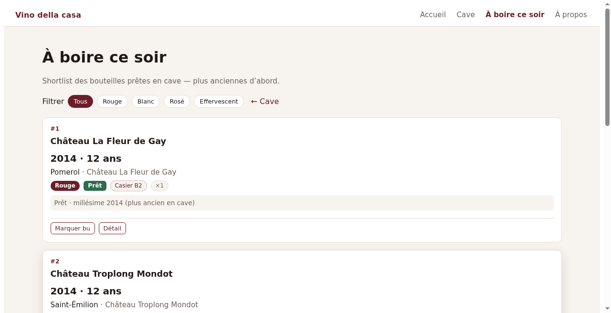
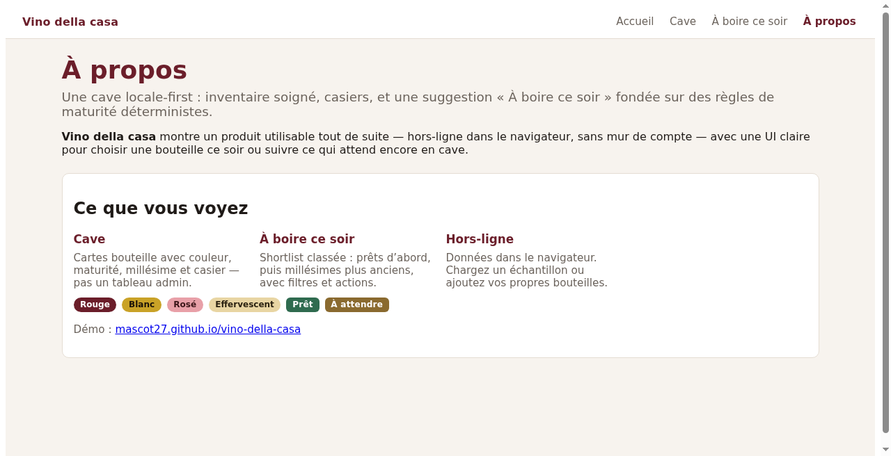

# Vino della casa

Local-first Blazor WebAssembly wine cellar: stock, bin locations, search, and a deterministic **drink tonight** helper.

**Demo:** https://mascot27.github.io/vino-della-casa/

## Screenshots






## Stack

- .NET 8 / Blazor WASM
- Domain + application layers, xUnit tests, GitHub Actions CI
- Offline path: `ICellarStore` + IndexedDB (in-memory store for CI)
- Optional local **MCP stdio** server (`src/VinoDellaCasa.Mcp`) for agent tools over domain logic

## Run locally

```bash
dotnet test
dotnet run --project src/VinoDellaCasa.Web
```

Open the URL shown by `dotnet run`. On GitHub Pages, open the demo link above (project site base path `/vino-della-casa/`).

## MCP server (stdio, local)

Read-only tools that call existing Domain logic (`MaturityRules`, seeds, `FieldSuggestions`, drink-tonight ranking). No network, no IndexedDB writes, no secrets.

Contract: `Docs/domain/MCP-TOOLS-CONTRACT.md`

### Tools

| Tool | Purpose |
|------|---------|
| `evaluate_maturity` | ReadyToDrink + style window for one bottle |
| `rank_drink_tonight` | Shortlist ready InStock bottles |
| `list_seed_bottles` | Anonymous sample cellar (`M1SeedData`) |
| `suggest_varietal_region` | Autocomplete for varietal / region / country |
| `get_color_labels` | FR labels + hex tokens |

### Run the server

```bash
dotnet run --project src/VinoDellaCasa.Mcp
```

The process speaks MCP over **stdio** (logs on stderr). Transport is local stdio only in v1 (no HTTP).

### Connect in Cursor

Add a server entry in Cursor MCP settings (project `.cursor/mcp.json` or user MCP config). Use an absolute path to this repo:

```json
{
  "mcpServers": {
    "vino-della-casa": {
      "command": "dotnet",
      "args": [
        "run",
        "--project",
        "/ABSOLUTE/PATH/TO/vino-della-casa/src/VinoDellaCasa.Mcp/VinoDellaCasa.Mcp.csproj",
        "--no-build"
      ]
    }
  }
}
```

Build once before `--no-build`, or drop `--no-build` to restore/build on connect:

```bash
dotnet build src/VinoDellaCasa.Mcp/VinoDellaCasa.Mcp.csproj -c Release
```

No API keys or tokens are required. Do not inject environment secrets into the MCP process.

### Security notes (v1)

- Tools are local compute / suggestions only
- Caps on list sizes (`bottles` ≤ 200, `topN` ≤ 20, suggestion `limit` ≤ 32)
- Color / status / field values validated against enums
- Out of scope: Millésima, remote IndexedDB, OAuth, purchases

## Docs

- `Docs/architecture.md` — IndexedDB vs test host
- `Docs/SPEC.md` — product & engineering notes
- `Docs/domain/` — maturity rules, sample seeds, MCP tool contract

## Dev hygiene

```bash
dotnet test --collect:"XPlat Code Coverage"
dotnet format
```

CI collects Coverlet cobertura results as a workflow artifact (no coverage threshold yet). `dotnet format --verify-no-changes` runs as a soft check (`continue-on-error`).
