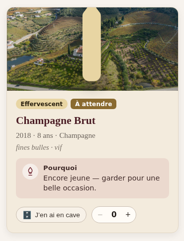
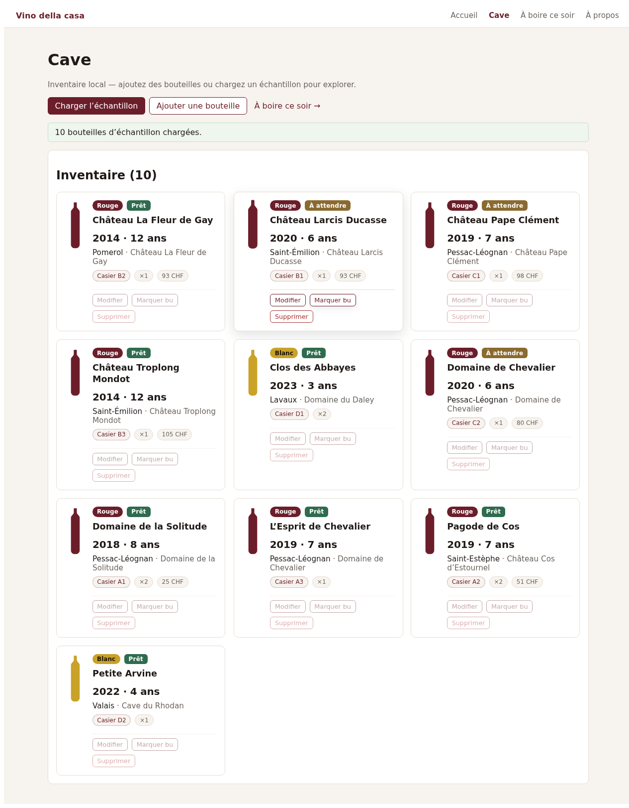
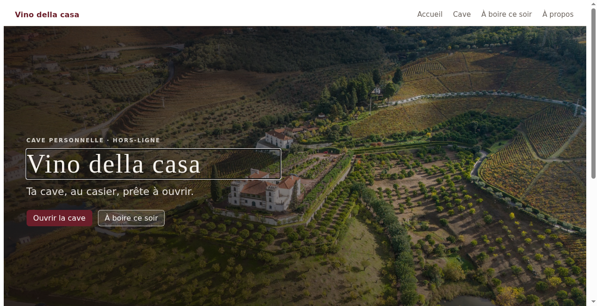
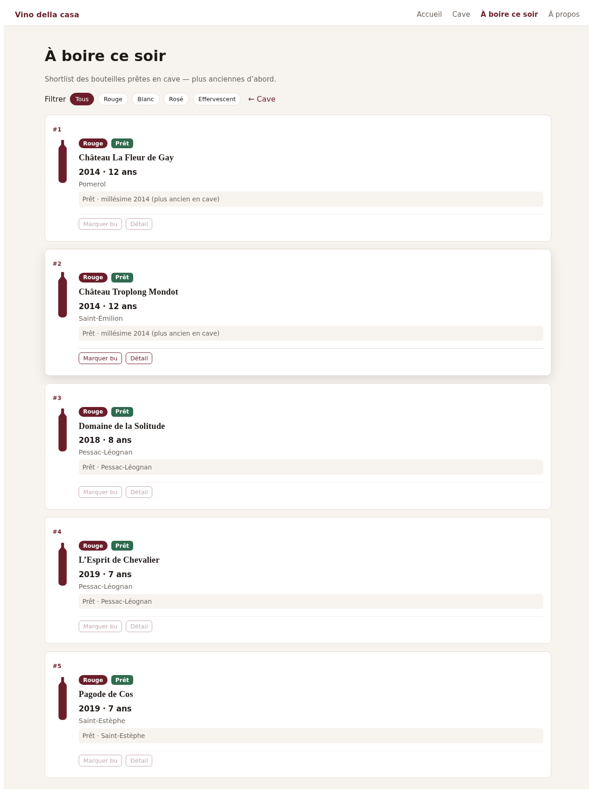

# Vino della casa

Local-first Blazor WebAssembly wine cellar: track stock and bin locations, search your bottles, and get a deterministic **drink tonight** shortlist.

**Live demo:** https://mascot27.github.io/vino-della-casa/

## Screenshots

Catalogue — fiche lettre:



Cave — catalogue / en cave:



Accueil:



Drink tonight — ranked ready bottles:



## Photo credits

Home hero, feature accents, and catalogue fiche backgrounds use local Unsplash photos (Unsplash License): Bob Brewer, Jennifer Yung, Gonzalo Facello — see `wwwroot/img/hero/ATTRIBUTION.md` and `wwwroot/img/catalog/ATTRIBUTION.md`.

## What it does

- **Cave** — catalogue-first letter fiches (image, style, pourquoi) + « J’en ai en cave » qty (IndexedDB)
- **Search & filters** — find bottles by varietal, region, status
- **Drink tonight** — rank bottles that are ready to drink from your cellar
- **Offline-friendly** — local store path (IndexedDB in the browser; in-memory for CI)

## Stack

- .NET 8 / Blazor WASM
- Domain + application layers, xUnit tests, GitHub Actions CI

## Run locally

```bash
dotnet test
dotnet run --project src/VinoDellaCasa.Web
```

Open the URL printed by `dotnet run`. On GitHub Pages, use the demo link above (site base path `/vino-della-casa/`).

## Code coverage

The [CI workflow runs](https://github.com/mascot27/vino-della-casa/actions/workflows/ci.yml) collect Coverlet coverage in Cobertura format. Select a run and download the **coverage** artifact to inspect the report; no coverage percentage is published or enforced.

To collect coverage locally, run:

```bash
dotnet test --collect:"XPlat Code Coverage"
```

## Docs

- `Docs/architecture.md` — IndexedDB vs test host
- `Docs/SPEC.md` — product & engineering notes
- `Docs/domain/` — maturity rules, sample seeds, MCP tool contract

## Local MCP server (Cursor / agents)

Read-only stdio tools over domain logic (`evaluate_maturity`, `rank_drink_tonight`, `list_seed_bottles`, …). Contract: `Docs/domain/MCP-TOOLS-CONTRACT.md`.

```bash
dotnet run --project src/VinoDellaCasa.Mcp
```

Example Cursor MCP config (no secrets — replace the absolute path):

```json
{
  "mcpServers": {
    "vino-della-casa": {
      "command": "dotnet",
      "args": ["run", "--project", "/ABS/PATH/TO/vino-della-casa/src/VinoDellaCasa.Mcp"]
    }
  }
}
```

Smoke: `dotnet test tests/VinoDellaCasa.Mcp.Tests`. Stdio only; no network writes.

## Dev hygiene

```bash
dotnet format
```

`dotnet format --verify-no-changes` runs as a soft check (`continue-on-error`).
