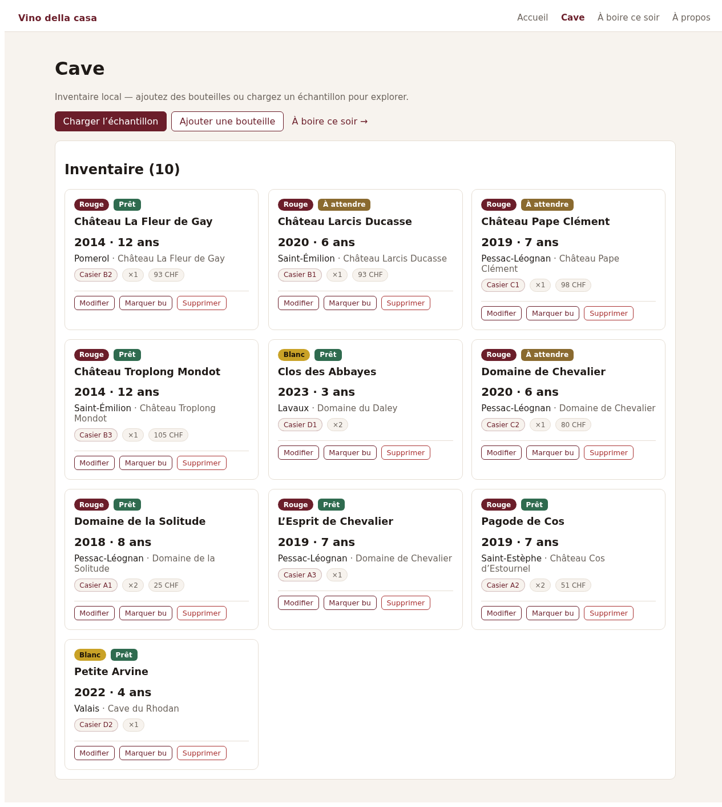
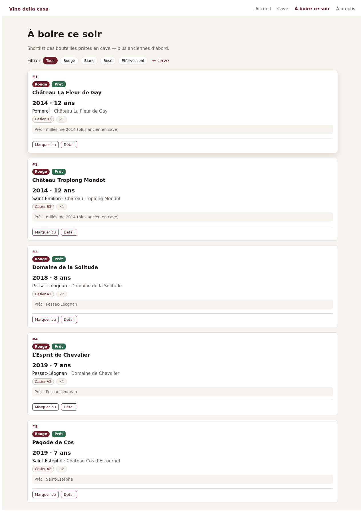

# Vino della casa

Local-first Blazor WebAssembly wine cellar: track stock and bin locations, search your bottles, and get a deterministic **drink tonight** shortlist.

**Live demo:** https://mascot27.github.io/vino-della-casa/

## Screenshots

Cellar — bottle cards:



Drink tonight — ranked ready bottles:



> Screenshots: drop real captures at the paths above (`docs/screenshots/`). Placeholders may be empty until webdesigner/VinoDev land the PNGs.

## What it does

- **Cave** — browse InStock bottles as cards (color, vintage, location)
- **Search & filters** — find bottles by varietal, region, status
- **Drink tonight** — rank bottles that are ready to drink from your cellar
- **Offline-friendly** — local store path (IndexedDB in the browser; in-memory for CI)

## Stack

- .NET 8 / Blazor WASM
- Domain + application layers, xUnit tests, GitHub Actions CI

## Run locally

```bash
dotnet test
dotnet run --project src/VinoDellaCasa.Web
```

Open the URL printed by `dotnet run`. On GitHub Pages, use the demo link above (site base path `/vino-della-casa/`).

## Docs

- `Docs/architecture.md` — IndexedDB vs test host
- `Docs/SPEC.md` — product & engineering notes
- `Docs/domain/` — maturity rules, sample seeds, MCP tool contract

Optional local MCP (stdio, read-only tools over domain logic): see `Docs/domain/MCP-TOOLS-CONTRACT.md` and run `dotnet run --project src/VinoDellaCasa.Mcp`.

## Dev hygiene

```bash
dotnet test --collect:"XPlat Code Coverage"
dotnet format
```

CI collects Coverlet cobertura results as a workflow artifact (no coverage threshold yet). `dotnet format --verify-no-changes` runs as a soft check (`continue-on-error`).
